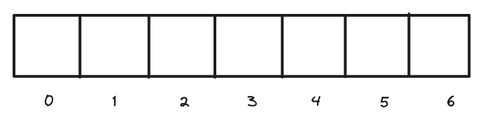
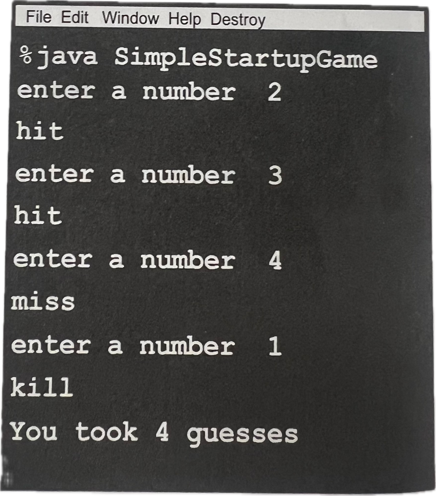

## <간단한 스타트업 게임>의 전반적인 소개
***

 

**목표** : 스타트업 인스턴스를 만들고,  
          그 어딘가에 인스턴스를 위치시키고,  
          사용자가 입력한 내용을 받아오며,  
          모든 스타트업 셀이 맞으면 게임을 끝냅니다.

 

**진행방법**  

1. 게임을 시작합니다.  
    그리고 스타트업 하나를 만들고 셀 일곱 개 가운데 셀 세 개에 그 위치를 할당합니다.  
    여기서는 "A2", "C4" 같은 식으로 할 필요 없이 그냥 정수 한 개만 있어도 됩니다.  
    예를 들어서, 아래 그림에서는 1,2,3이 셀 위치가 됩니다.   
      
2. 게임을 진행합니다.  
    사용자에게 위치를 물어보는 프롬프트를 띄우고 스타트업에 들어 있는 셀 세 개 중에서 하나에 적중했는지 확인합니다.  
    제대로 맞힌 경우에는 numOfHits 변수를 증가시킵니다.   
3. 셀 세개를 모두 맞히면(numOfHits 변수의 값이 3이 되면) 게임이 끝납니다.
    사용자에게 몇 번의 추측 끝에 스타트업을 침몰시켰는지 알려 줍니다.
     
**게임 상호작용 과정:**  

