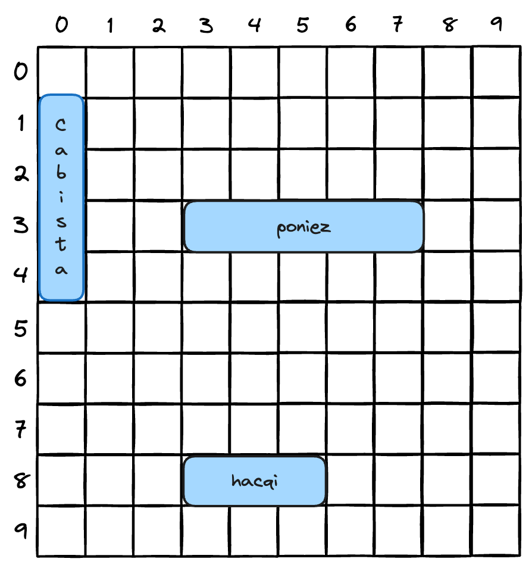

# 진짜 <스타트업 침몰시키기> 게임 만들어보기
***

 

**목표** : 컴퓨터가 가지고 있는 모든 스타트업명을 최소한의 추측횟수로 모두 침몰시켜야 합니다.  
　　　　　　　스타트업을 모두 침몰 시키고 나면 성적에 따라 등급이 출력됩니다.

 

**설정** : 게임 프로그램이 시작되면 컴퓨터에서는 스타트업 세 개를 **가상의 7X7 그리드** 위에 배치합니다.
　　　　　　　그 작업이 끝나면 사용자가 추측한 위치를 입력할 수 있도록 프롬프트를 출력합니다.

**게임방법**  

아직은 GUI를 만드는 방법을 배우지 않았으므로 명령행에서 실행시키는 버전으로 만들겠습니다.  
컴퓨터에서는 여러분에게 위치를 추측해보라는 프롬프트를 띄웁니다.  
그러면 여러분은 "A3", "C2" 같은 식으로 명령행에 위치를 입력합니다.  
컴퓨터에서 명령행을 통해 맞으면 "hit", 틀리면 "miss"라고 결과를 알려줍니다.  
어떤 스타트업 사이트를 모두 맞히면 "You sunk poniez(=스타트업명)"와 같은 메시지를 출력합니다.  
스타트업 세 개를 모두 맞히면 여러분의 등급이 출력됩니다.

**7X7 그리드 예시:**  
자바 배열처럼 0에서 시작  
각 상자는 '셀'입니다.  
